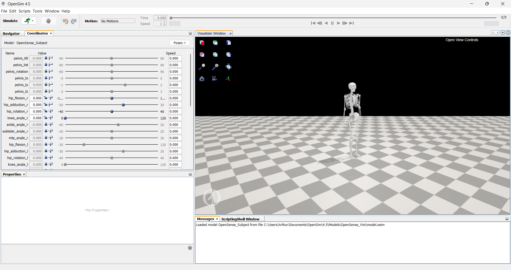
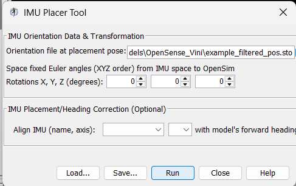
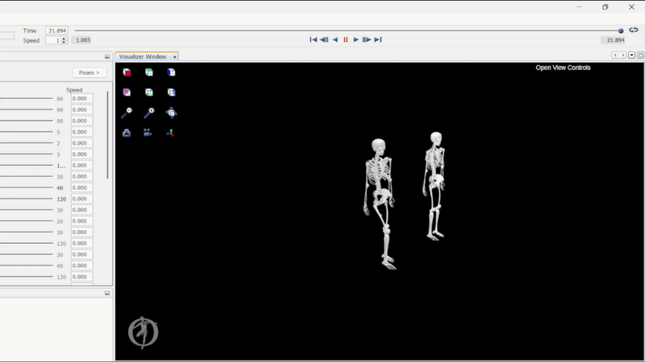

# OpenSense IMU

Repositório de captura de dados inerciais para o **OpenSense** (OpenSim). 

Este projeto contém scripts em Python desenvolvidos para comunicar com sensores IMU, gravar dados em tempo real e exportá-los automaticamente para o formato `.sto`, permitindo a análise de cinemática inversa diretamente no OpenSim.

---

## Visão Geral

O fluxo de trabalho deste repositório é simples:
1. **Conexão:** O script conecta-se ao Dongle USB e recebe dados de múltiplos sensores simultaneamente.
2. **Captura:** Os dados brutos de orientação em quaternions são salvos em formato JSON.
3. **Processamento:** Ao finalizar a captura, o script converte os dados para o formato `.sto` utilizado no OpenSense.

### Estrutura de Arquivos
* `runOpenSenseCapture.py`: Script principal para realizar coletas completas. 
* `json_to_sto.py`: Script para converter/reprocessar coletas antigas gravadas em formto JSON.
* `utils/`: Pasta contendo as bibliotecas de comunicação serial, filtros e operações de arquivo.

---

## Preparação do Ambiente

Siga estes passos para configurar o seu computador na primeira utilização.

### 1. Instalar o Python
É necessário ter o **Python 3.8** (ou superior) instalado.
* Verifique se já possui: Abra o terminal/CMD e digite `python --version`.
* Se não tiver, baixe e instale a partir de [python.org](https://www.python.org/downloads/).
    * *Nota (Windows):* Na instalação, marque a caixa **"Add Python to PATH"**.

### 2. Criar o Ambiente Virtual (Venv)
Para manter o projeto organizado e evitar conflitos de bibliotecas, usamos um ambiente virtual.

1. Abra o terminal (ou PowerShell/CMD) na pasta raiz deste projeto.
2. Crie o ambiente executando:
   ```bash
   python3 -m venv .envOpensense
   ```

3. Ative o ambiente:
   * **Windows:**
     ```powershell
     .envOpensense\Scripts\Activate
     ```
   * **Linux / Mac:**
     ```bash
     source .envOpensense/bin/activate
     ```
   *(Você verá `(.envOpensense)` no início da linha de comando quando estiver ativo).*

### 3. Instalar Dependências
Com o ambiente `.envOpensense` ativado, instale todos os pacotes de uma vez utilizando o arquivo `requirements.txt` com o comando:
```bash
pip install -r requirements.txt
```

Serão instalados os seguintes pacotes:
```text
pyserial
numpy
pandas
scipy
openpyxl
```
### 4. Instalação do OpenSim

O **OpenSim** é uma plataforma *open-source* para modelagem e simulação de sistemas biomecânicos. Para este projeto, utilizamos o **OpenSense**, um conjunto de ferramentas (integrado nativamente nas versões recentes) que permite a análise de movimentos a partir de dados de sensores inerciais (IMUs), mapeando-os em modelos musculoesqueléticos.

1.  **Download:** Acesse o site oficial [SimTK - OpenSim](https://simtk.org/frs/?group_id=91).
2.  **Versão Recomendada:** Utilize o **OpenSim 4.5** (versão base deste projeto). Versões superiores podem funcionar, mas esta garante compatibilidade total com os scripts de conversão.
3.  **Cadastro:** Será necessário criar uma conta gratuita no SimTK para baixar os arquivos.
4.  **Aprendizado Adicional:** Para entender a interface além deste guia, consulte os [Tutoriais Oficiais do OpenSim](https://opensimconfluence.atlassian.net/wiki/spaces/OpenSim/pages/53114247/Introductory+Examples).

---

## Uso prático

### Como Realizar uma Coleta

#### Passo 1: Configuração dos Sensores
Antes de rodar o código, você deve informar quais sensores está usando. Abra o arquivo `runOpenSenseCapture.py` numa IDE (VS Code, PyCharm, etc) e edite as variáveis iniciais:

```python
# IDs lógicos dos sensores (verifique o número escrito no hardware do sensor)
imu_ids = [9, 10]

# Nomes dos segmentos no OpenSim
# A ordem deve corresponder exatamente aos IDs acima
imu_labels = ["femur_r_imu", "tibia_r_imu"]

# Caminho e nome do arquivo a ser salvo sem extensão
file_name = "examples/Coleta_Sujeito01/caminhada_teste"
```

#### Passo 2: Inicialização e Referencial
Esta etapa define a orientação global dos sensores.

1. Posicionamento na Mesa: Antes de iniciar o programa, coloque os IMUs em uma mesa plana, um ao lado do outro. Aponte o lado do LED dos sensores para a direção em que o movimento será capturado.

2. Conecte o Dongle USB ao computador e ligue os sensores IMU.

3. No terminal (com o `.envOpensense` ativado), execute:
    ```bash
    python runOpenSenseCapture.py
    ```
    Aguarde o terminal exibir a mensagem "IMU ready to use". Neste momento, o script fará uma pausa aguardando que o usuário pressione Enter. Ainda não pressione!

#### Passo 3: Posicionamento das IMUs no Sujeito e Gravação
1. Fixação: Com o script pausado, pegue os IMUs da mesa e posicione-os firmemente nos segmentos corporais do sujeito. Não há orientação específica necessária

2. Pose de Referência: O sujeito deve se posicionar na mesma postura do modelo utilizado no OpenSim (geralmente uma pose estática com os braços relaxados).

3. Alinhamento do Corpo: É crucial que o sujeito esteja virado exatamente para a mesma direção em que os LEDs dos IMUs estavam apontando na mesa durante o Passo 2.
    * *Nota:* Este passo é desnecessário caso haja um imu no torso ou pelvis que sirva como heading direction.

4. Iniciar Gravação: Com o sujeito posicionado e imóvel, pressione a tecla Enter no terminal para iniciar de fato a gravação do arquivo.

5. Realize o protocolo de movimentos desejado.

6. Finalizar: Para encerrar a coleta, clique na janela do terminal e pressione Ctrl + C. O script irá parar o streaming, salvar o .json e gerar automaticamente o arquivo .sto processado.


#### Arquivos de Saída

Para cada coleta, serão gerados três arquivos na pasta configurada:

1. **`nome_arquivo.json`**:
   * Contém os dados brutos (Timestamp e Quaternions).
   * Útil para backup ou reprocessamento futuro.

2. **`nome_arquivo_pos.sto`**:
   * Arquivo de posicionamento do OpenSim.
   * Contém cabeçalho do OpenSim, dados filtrados (Butterworth Lowpass) e reamostrados.
   * **Este é o arquivo que você deve carregar na ferramenta "IMU Placer" do OpenSim.**

3. **`nome_arquivo_mov.sto`**:
   * Arquivo final processado.
   * Contém cabeçalho do OpenSim, dados filtrados (Butterworth Lowpass) e reamostrados.
   * **Este é o arquivo que você deve carregar na ferramenta "IMU Inverse Kinematics" do OpenSim.**

### Fluxo de Processamento no OpenSim

#### 1. Preparação do Modelo e Ambiente

No OpenSim, um **modelo** (`.osim`) representa a estrutura física (ossos, juntas e músculos) que será animada. 

> [!CAUTION]
> **Erro 106:** O OpenSim pode falhar ao carregar arquivos em pastas sem permissão de escrita (como dentro de `C:\Program Files`). Recomenda-se criar uma pasta própria em `Documents\OpenSim\4.5\Models\MeuProjeto` e colocar o arquivo `model.osim` e todos os arquivos gerados (`.sto`) nela.

* **Abrir o Modelo:** Use `Ctrl + O` ou vá em `File > Open Model` e selecione o arquivo `model.osim`.
* **Visualização:** Após o carregamento, a interface principal exibirá o modelo esquelético.



#### 2. Ajustes de Coordenadas

Antes de importar os dados, verifique a pose e as articulações na aba lateral esquerda:

* **Aba Navigator:** Lista os modelos ativos.
* **Aba Coordinates:** Permite controlar a angulação das juntas.
    * Clique em `Poses > Default` para garantir a postura padrão.
    * **Trava de Juntas:** Neste repositório, focamos nos movimentos de **Tíbia** e **Fêmur** direitos. Se você não estiver usando sensores para outros membros, clique no ícone de **cadeado** ao lado dos nomes das outras juntas para evitar movimentos indesejados.

#### 3. Posicionamento Virtual (IMU Placer)

O **IMU Placer** alinha a orientação dos sensores reais ao modelo virtual.

1.  Selecione o modelo desejado na aba *Navigator*.
2.  No menu superior, acesse `Tools > IMU Placer`.
3.  Em **"Orientation file at placement pose"**, clique no ícone de pasta e selecione o arquivo **`nome_arquivo_pos.sto`**.
    * *Dica de teste:* Use `examples/exampleLARA/example_filtered_pos.sto`.
4.  Clique em **Run**. Uma cópia do modelo aparecerá com cubos coloridos indicando o local dos sensores.



#### 4. Cinemática Inversa (IMU Inverse Kinematics)

Esta etapa aplica os dados de movimento contínuo ao modelo posicionado.

1.  Vá em `Tools > IMU Inverse Kinematics`.
2.  Em **"Sensor orientation file (quaternions)"**, carregue o arquivo **`nome_arquivo_mov.sto`**.
    * *Dica de teste:* Use `examples/exampleLARA/example_filtered_mov.sto`.
3.  Clique em **Run** e aguarde a barra de progresso no canto inferior.
4.  **Reprodução:** Use o slider de "Play" no topo da tela para visualizar o movimento.


---